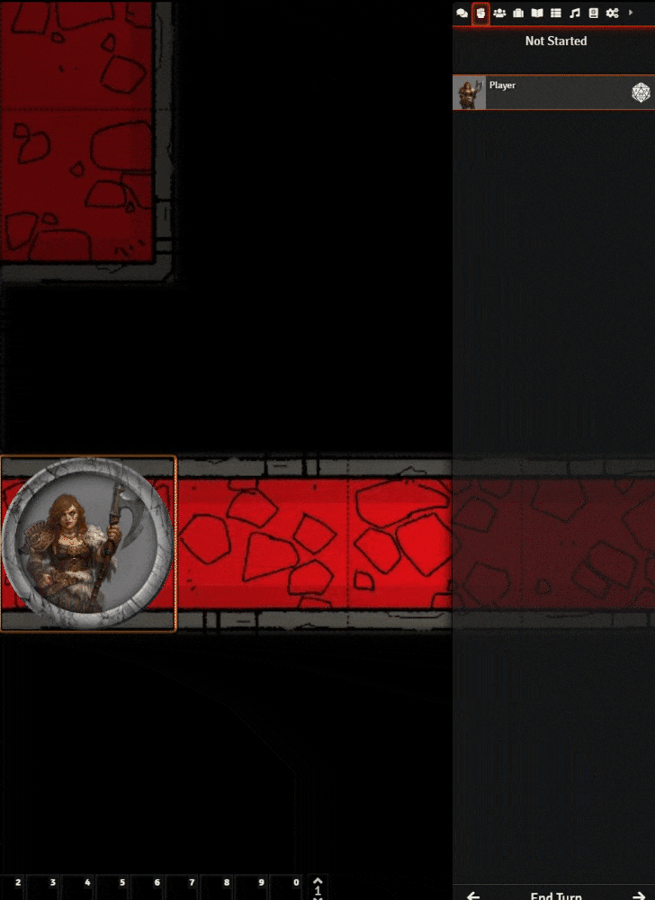

<!--- Downloads @ Latest Badge -->
<!--- replace <user>/<repo> with your username/repository -->

<!--- Forge Bazaar Install % Badge -->
<!--- replace <your-module-name> with the `name` in your manifest -->

# FoundryVTT Token Self Initiative

This module adds a `/init` command to the foundry chat. So now your players can simply select tokens and enter a command like this: `/init 7` where 7 is desired initiative value.
This module only works if GM is online!

**This module is inherently insecure and opens an exploit to allow malicious users to set an initiative to tokens they do not own.
This can not be done not on purpose. Because the module validates on the user side owns the token or not. But in theory, they can write some console commands to do this. 
Use this module with people you trust.**

## Installation

Link to manifest: `https://github.com/mikkerlo/fvtt-token-self-initiative/releases/latest/download/module.json`

## Changelog

1.0 -- Release first version
