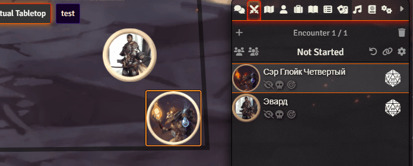

<!--- Forge Bazaar Install % Badge -->
<!--- replace <your-module-name> with the `name` in your manifest -->

# FoundryVTT Token Self Initiative

This module adds multiple ways to manually change token initiative:
1. Select token of which initiative you want to change and press I button(can be changed).
2. Select token of which initiative you want to change and type `/init 7` in chat, where 7 is desired initiative.
3. Secret way, now in beta.

# Examples

## Example with hotkey

## Example with chat command

## Installation

Link to manifest: `https://github.com/mikkerlo/fvtt-token-self-initiative/releases/latest/download/module.json`

